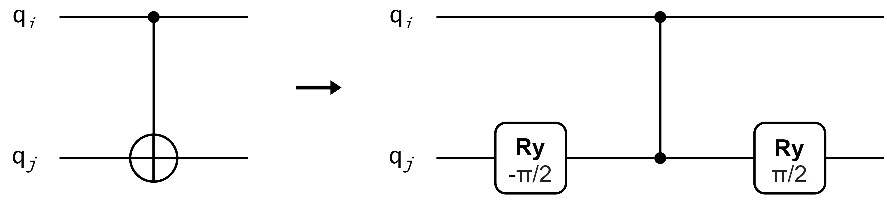
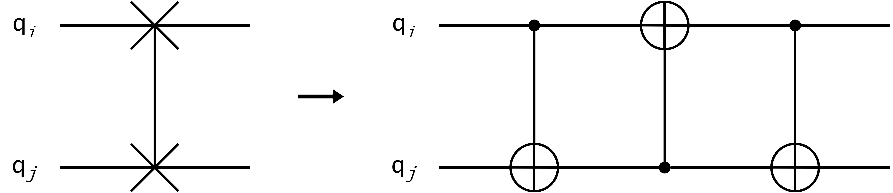
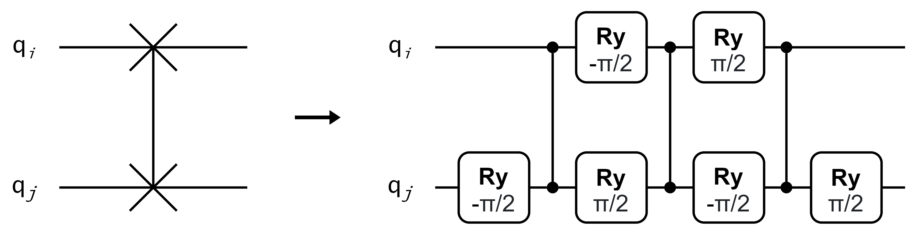

There are various ways in which the design of a circuit can be tailored to meet specific needs.

1. [Merging Single Qubit Gates](../applying-compilation-passes/merging-single-qubit-gates.md)
2. [Custom Quantum Gates](../applying-compilation-passes/custom-gates.md)

## Gate Decomposition

OpenSquirrel can also _decompose_ the gates of a quantum circuit, given a specific decomposition.
The package offers several, so-called, decomposers out of the box,
but users can also make their own decomposer and apply them to the circuit.
Decompositions can be:

1. [Predefined](../applying-compilation-passes/decomposition/predefined-decomposition.md)
2. [Inferred](../applying-compilation-passes/decomposition/inferred-decomposition.md) from the gate semantics.

## Exporting a circuit

As you have seen in the examples above, you can turn a circuit into a
[cQASM](https://qutech-delft.github.io/cQASM-spec) string
by simply using the `str` or `__repr__` methods.
We are aiming to support the possibility to export to other languages as well,
_e.g._, a OpenQASM 3.0 string, and frameworks, _e.g._, a Qiskit quantum circuit.

## Compilation Passes

OpenSquirrel has several ready to use, out of the box compilation passes, meant to perform necessary modifications to
the quantum circuit and facilitate its execution on a quantum computer.

These compilation passes include the following:

1. [Decomposition](../../compilation-passes/types-of-passes/decomposition/index.md)
2. [Exporting](../../compilation-passes/types-of-passes/exporting/index.md)
3. [Mapping](../../compilation-passes/types-of-passes/mapping/index.md)
4. [Merging](../../compilation-passes/types-of-passes/merging/index.md)
5. [Routing](../../compilation-passes/types-of-passes/routing/index.md)
6. [Validation](../../compilation-passes/types-of-passes/validation/index.md)


## Modifying a circuit

### Merging single qubit gates

All single-qubit gates appearing in a circuit can be merged by applying `merge(merger=SingleQubitGatesMerger())` to the circuit.
Note that multi-qubit gates remain untouched and single-qubit gates are not merged across any multi-qubit gates.
The gate that results from the merger of single-qubit gates will, in general,
comprise an arbitrary rotation and, therefore, not be a known gate.
In OpenSquirrel an unrecognized gate is deemed _anonymous_.
When a circuit contains anonymous gates and is written to a cQASM string,
the semantic representation of the anonymous gate is exported.

!!! warning

    The semantic representation of an anonymous gate is not compliant
    [cQASM](https://qutech-delft.github.io/cQASM-spec), meaning that
    a cQASM parser, _e.g._ [libQASM](https://qutech-delft.github.io/libqasm/),
    will not recognize it as a valid statement.

```python
from opensquirrel.circuit_builder import CircuitBuilder
from opensquirrel.passes.merger import SingleQubitGatesMerger
from opensquirrel.ir import Float
import math

builder = CircuitBuilder(1)
for _ in range(4):
    builder.Rx(0, math.pi / 4)
qc = builder.to_circuit()

qc.merge(merger=SingleQubitGatesMerger())

print(qc)
```
_Output_:

    version 3.0

    qubit[1] q

    BlochSphereRotation(qubit=Qubit[0], axis=[1. 0. 0.], angle=3.14159, phase=0.0)

In the above example, OpenSquirrel has merged all the Rx gates together.
Yet, for now, OpenSquirrel does not recognize that this results in a single Rx
over the cumulated angle of the individual rotations.
Moreover, it does not recognize that the result corresponds to the X gate (up to a global phase difference).
At a later stage, we may want OpenSquirrel to recognize the resultant gate
in the case it is part of the set of known gates.

The gate set is, however, not immutable.
In the following section, we demonstrate how new gates can be defined and added to the default gate set.

### Defining your own quantum gates

OpenSquirrel accepts any new gate and requires its definition in terms of a semantic.
Creating new gates is done using Python functions, decorators, and one of the following gate semantic classes:
`BlochSphereRotation`, `ControlledGate`, or `MatrixGate`.

- The `BlochSphereRotation` class is used to define an arbitrary single qubit gate.
It accepts a qubit, an axis, an angle, and a phase as arguments.
Below is shown how the X-gate is defined in the default gate set of OpenSquirrel:

```python
from opensquirrel.ir import Gate, BlochSphereRotation, QubitLike, named_gate
import math

@named_gate
def x(q: QubitLike) -> Gate:
    return BlochSphereRotation(qubit=q, axis=(1, 0, 0), angle=math.pi, phase=math.pi / 2)
```

Notice the `@named_gate` decorator.
This _tells_ OpenSquirrel that the function defines a gate and that it should,
therefore, have all the nice properties OpenSquirrel expects of it.

- The `ControlledGate` class is used to define a multiple qubit gate that comprises a controlled operation.
For instance, the `CNOT` gate is defined in the default gate set of OpenSquirrel as follows:

```python
from opensquirrel.ir import Gate, ControlledGate, QubitLike, named_gate
from opensquirrel import X

@named_gate
def cnot(control: QubitLike, target: QubitLike) -> Gate:
    return ControlledGate(control, X(target))
```

- The `MatrixGate` class may be used to define a gate in the generic form of a matrix:

```python
from opensquirrel.ir import Gate, MatrixGate, QubitLike, named_gate

@named_gate
def swap(q1: QubitLike, q2: QubitLike) -> Gate:
    return MatrixGate(
        [
            [1, 0, 0, 0],
            [0, 0, 1, 0],
            [0, 1, 0, 0],
            [0, 0, 0, 1],
        ],
        [q1, q2],
    )
```

!!! note

    User defined gates can only be used in when creating a circuit with the circuit builder.
    [cQASM](https://qutech-delft.github.io/cQASM-spec) parsers will not recognize user defined gates, _i.e._,
    they cannot be used when creating a circuit through a cQASM string.

### Gate decomposition

OpenSquirrel can decompose the gates of a quantum circuit, given a specific decomposition.
OpenSquirrel offers several, so-called, decomposers out of the box,
but users can also make their own decomposer and apply them to the circuit.
Decompositions can be:
   1. predefined, or;
   2. inferred from the gate semantics.

#### 1. Predefined decomposition

The first kind of decomposition is when you want to replace a particular gate in the circuit,
like the `CNOT` gate, with a fixed list of gates.
It is commonly known that `CNOT` can be decomposed as `H`-`CZ`-`H`.
This decomposition is demonstrated below using a Python _lambda function_,
which requires the same parameters as the gate that is decomposed:

```python
from opensquirrel.circuit import Circuit
from opensquirrel import CNOT, H, CZ

qc = Circuit.from_string(
    """
    version 3.0
    qubit[3] q

    X q[0:2]  // Note that this notation is expanded in OpenSquirrel.
    CNOT q[0], q[1]
    Ry q[2], 6.78
    """
)
qc.replace(
    CNOT,
    lambda control, target:
    [
        H(target),
        CZ(control, target),
        H(target),
    ]
)

print(qc)
```
_Output_:

    version 3.0

    qubit[3] q

    X q[0]
    X q[1]
    X q[2]
    H q[1]
    CZ q[0], q[1]
    H q[1]
    Ry(6.78) q[2]

OpenSquirrel will check whether the provided decomposition is correct.
For instance, an exception is thrown if we forget the final Hadamard,
or H gate, in our custom-made decomposition:

```python
from opensquirrel.circuit import Circuit
from opensquirrel import CNOT, CZ, H

qc = Circuit.from_string(
    """
    version 3.0
    qubit[3] q

    X q[0:2]
    CNOT q[0], q[1]
    Ry q[2], 6.78
    """
)
try:
    qc.replace(
        CNOT,
        lambda control, target:
        [
            H(target),
            CZ(control, target),
        ]
    )
except Exception as e:
  print(e)
```
_Output_:

    replacement for gate CNOT does not preserve the quantum state

##### _`CNOT` to `CZ` decomposer_

The decomposition of the `CNOT` gate into a `CZ` gate (with additional single-qubit gates) is used frequently.
To this end a `CNOT2CZDecomposer` has been implemented that decomposes any `CNOT`s in a circuit to a
`Ry(-π/2)`-`CZ`-`Ry(π/2)`. The decomposition is illustrated in the image below.

<p align="center">  </p>

`Ry` gates are used instead of, _e.g._, `H` gates, as they are, generally,
more likely to be supported already by target backends.

##### _`SWAP` to `CNOT` decomposer_

The `SWAP2CNOTDecomposer` implements the predefined decomposition of the `SWAP` gate into 3 `CNOT` gates.
The decomposition is illustrated in the image below.

<p align="center">  </p>

##### _`SWAP` to `CZ` decomposer_

The `SWAP2CZDecomposer` implements the predefined decomposition of the `SWAP` gate into `Ry` rotations and 3 `CZ`
gates.
The decomposition is illustrated in the image below.

<p align="center">  </p>


#### 2. Inferred decomposition

OpenSquirrel has a variety inferred decomposition strategies.
More in depth tutorials can be found in the [decomposition example Jupyter notebook](https://github.com/QuTech-Delft/OpenSquirrel/blob/develop/example/decompositions.ipynb).

One of the most common single qubit decomposition techniques is the ZYZ decomposition.
This technique decomposes a quantum gate into an `Rz`, `Ry` and `Rz` gate in that order.
The decompositions are found in `opensquirrel.passes.decomposer`,
an example can be seen below where a `H`, `Z`, `Y`, and `Rx` gate are all decomposed on a single qubit circuit.

```python
from opensquirrel.circuit_builder import CircuitBuilder
from opensquirrel.passes.decomposer import ZYZDecomposer
import math

builder = CircuitBuilder(qubit_register_size=1)
builder.H(0).Z(0).Y(0).Rx(0, math.pi / 3)
qc = builder.to_circuit()

qc.decompose(decomposer=ZYZDecomposer())

print(qc)
```
_Output_:

    version 3.0

    qubit[1] q

    Rz(3.1415927) q[0]
    Ry(1.5707963) q[0]
    Rz(3.1415927) q[0]
    Ry(3.1415927) q[0]
    Rz(1.5707963) q[0]
    Ry(1.0471976) q[0]
    Rz(-1.5707963) q[0]

Similarly, the decomposer can be used on individual gates.

```python
from opensquirrel.passes.decomposer import ZYZDecomposer
from opensquirrel import H

print(ZYZDecomposer().decompose(H(0)))
```
_Output_:

    [BlochSphereRotation(qubit=Qubit[0], axis=Axis[0. 0. 1.], angle=1.5707963267948966, phase=0.0),
     BlochSphereRotation(qubit=Qubit[0], axis=Axis[0. 1. 0.], angle=1.5707963267948966, phase=0.0),
     BlochSphereRotation(qubit=Qubit[0], axis=Axis[0. 0. 1.], angle=1.5707963267948966, phase=0.0)]


OpenSquirrel accepts any new gate and requires its definition in terms of a semantic.
Creating new gates is done using Python functions, decorators, and one of the following gate semantic classes:
`BlochSphereRotation`, `ControlledGate`, or `MatrixGate`.

- The `BlochSphereRotation` class is used to define an arbitrary single qubit gate.
It accepts a qubit, an axis, an angle, and a phase as arguments.
Below is shown how the X-gate is defined in the default gate set of OpenSquirrel:

```python
from opensquirrel.ir import Gate, BlochSphereRotation, QubitLike, named_gate
import math

@named_gate
def x(q: QubitLike) -> Gate:
    return BlochSphereRotation(qubit=q, axis=(1, 0, 0), angle=math.pi, phase=math.pi / 2)
```

Notice the `@named_gate` decorator.
This _tells_ OpenSquirrel that the function defines a gate and that it should,
therefore, have all the nice properties OpenSquirrel expects of it.

- The `ControlledGate` class is used to define a multiple qubit gate that comprises a controlled operation.
For instance, the `CNOT` gate is defined in the default gate set of OpenSquirrel as follows:

```python
from opensquirrel.ir import Gate, ControlledGate, QubitLike, named_gate
from opensquirrel import X

@named_gate
def cnot(control: QubitLike, target: QubitLike) -> Gate:
    return ControlledGate(control, X(target))
```

- The `MatrixGate` class may be used to define a gate in the generic form of a matrix:

```python
from opensquirrel.ir import Gate, MatrixGate, QubitLike, named_gate

@named_gate
def swap(q1: QubitLike, q2: QubitLike) -> Gate:
    return MatrixGate(
        [
            [1, 0, 0, 0],
            [0, 0, 1, 0],
            [0, 1, 0, 0],
            [0, 0, 0, 1],
        ],
        [q1, q2],
    )
```

!!! note

    User defined gates can only be used in when creating a circuit with the circuit builder.
    [cQASM](https://qutech-delft.github.io/cQASM-spec) parsers will not recognize user defined gates, _i.e._,
    they cannot be used when creating a circuit through a cQASM string.

All single-qubit gates appearing in a circuit can be merged by applying `merge(merger=SingleQubitGatesMerger())` to the circuit.
Note that multi-qubit gates remain untouched and single-qubit gates are not merged across any multi-qubit gates.
The gate that results from the merger of single-qubit gates will, in general,
comprise an arbitrary rotation and, therefore, not be a known gate.
In OpenSquirrel an unrecognized gate is deemed _anonymous_.
When a circuit contains anonymous gates and is written to a cQASM string,
the semantic representation of the anonymous gate is exported.

!!! warning

    The semantic representation of an anonymous gate is not compliant
    [cQASM](https://qutech-delft.github.io/cQASM-spec), meaning that
    a cQASM parser, _e.g._ [libQASM](https://qutech-delft.github.io/libqasm/),
    will not recognize it as a valid statement.

```python
from opensquirrel.circuit_builder import CircuitBuilder
from opensquirrel.passes.merger import SingleQubitGatesMerger
from opensquirrel.ir import Float
import math

builder = CircuitBuilder(1)
for _ in range(4):
    builder.Rx(0, math.pi / 4)
qc = builder.to_circuit()

qc.merge(merger=SingleQubitGatesMerger())

print(qc)
```
_Output_:

    version 3.0

    qubit[1] q

    BlochSphereRotation(qubit=Qubit[0], axis=[1. 0. 0.], angle=3.14159, phase=0.0)

In the above example, OpenSquirrel has merged all the Rx gates together.
Yet, for now, OpenSquirrel does not recognize that this results in a single Rx
over the cumulated angle of the individual rotations.
Moreover, it does not recognize that the result corresponds to the X gate (up to a global phase difference).
At a later stage, we may want OpenSquirrel to recognize the resultant gate
in the case it is part of the set of known gates.

The gate set is, however, not immutable.
In the following section, we demonstrate how new gates can be defined and added to the default gate set.

OpenSquirrel has a variety inferred decomposition strategies.
More in depth tutorials can be found in the [decomposition example Jupyter notebook](https://github.com/QuTech-Delft/OpenSquirrel/blob/develop/example/decompositions.ipynb).

One of the most common single qubit decomposition techniques is the ZYZ decomposition.
This technique decomposes a quantum gate into an `Rz`, `Ry` and `Rz` gate in that order.
The decompositions are found in `opensquirrel.passes.decomposer`,
an example can be seen below where a `H`, `Z`, `Y`, and `Rx` gate are all decomposed on a single qubit circuit.

```python
from opensquirrel.circuit_builder import CircuitBuilder
from opensquirrel.passes.decomposer import ZYZDecomposer
import math

builder = CircuitBuilder(qubit_register_size=1)
builder.H(0).Z(0).Y(0).Rx(0, math.pi / 3)
qc = builder.to_circuit()

qc.decompose(decomposer=ZYZDecomposer())

print(qc)
```
_Output_:

    version 3.0

    qubit[1] q

    Rz(3.1415927) q[0]
    Ry(1.5707963) q[0]
    Rz(3.1415927) q[0]
    Ry(3.1415927) q[0]
    Rz(1.5707963) q[0]
    Ry(1.0471976) q[0]
    Rz(-1.5707963) q[0]

Similarly, the decomposer can be used on individual gates.

```python
from opensquirrel.passes.decomposer import ZYZDecomposer
from opensquirrel import H

print(ZYZDecomposer().decompose(H(0)))
```
_Output_:

    [BlochSphereRotation(qubit=Qubit[0], axis=Axis[0. 0. 1.], angle=1.5707963267948966, phase=0.0),
     BlochSphereRotation(qubit=Qubit[0], axis=Axis[0. 1. 0.], angle=1.5707963267948966, phase=0.0),
     BlochSphereRotation(qubit=Qubit[0], axis=Axis[0. 0. 1.], angle=1.5707963267948966, phase=0.0)]

The first kind of decomposition is when you want to replace a particular gate in the circuit,
like the `CNOT` gate, with a fixed list of gates.
It is commonly known that `CNOT` can be decomposed as `H`-`CZ`-`H`.
This decomposition is demonstrated below using a Python _lambda function_,
which requires the same parameters as the gate that is decomposed:

```python
from opensquirrel.circuit import Circuit
from opensquirrel import CNOT, H, CZ

qc = Circuit.from_string(
    """
    version 3.0
    qubit[3] q

    X q[0:2]  // Note that this notation is expanded in OpenSquirrel.
    CNOT q[0], q[1]
    Ry q[2], 6.78
    """
)
qc.replace(
    CNOT,
    lambda control, target:
    [
        H(target),
        CZ(control, target),
        H(target),
    ]
)

print(qc)
```
_Output_:

    version 3.0

    qubit[3] q

    X q[0]
    X q[1]
    X q[2]
    H q[1]
    CZ q[0], q[1]
    H q[1]
    Ry(6.78) q[2]

OpenSquirrel will check whether the provided decomposition is correct.
For instance, an exception is thrown if we forget the final Hadamard,
or H gate, in our custom-made decomposition:

```python
from opensquirrel.circuit import Circuit
from opensquirrel import CNOT, CZ, H

qc = Circuit.from_string(
    """
    version 3.0
    qubit[3] q

    X q[0:2]
    CNOT q[0], q[1]
    Ry q[2], 6.78
    """
)
try:
    qc.replace(
        CNOT,
        lambda control, target:
        [
            H(target),
            CZ(control, target),
        ]
    )
except Exception as e:
  print(e)
```
_Output_:

    replacement for gate CNOT does not preserve the quantum state


## _`CNOT` to `CZ` decomposer_

The decomposition of the `CNOT` gate into a `CZ` gate (with additional single-qubit gates) is used frequently.
To this end a `CNOT2CZDecomposer` has been implemented that decomposes any `CNOT`s in a circuit to a
`Ry(-π/2)`-`CZ`-`Ry(π/2)`. The decomposition is illustrated in the image below.

<p align="center">  </p>

`Ry` gates are used instead of, _e.g._, `H` gates, as they are, generally,
more likely to be supported already by target backends.

## _`SWAP` to `CNOT` decomposer_

The `SWAP2CNOTDecomposer` implements the predefined decomposition of the `SWAP` gate into 3 `CNOT` gates.
The decomposition is illustrated in the image below.

<p align="center">  </p>

## _`SWAP` to `CZ` decomposer_

The `SWAP2CZDecomposer` implements the predefined decomposition of the `SWAP` gate into `Ry` rotations and 3 `CZ`
gates.
The decomposition is illustrated in the image below.

<p align="center">  </p>

## Validating Aspects of a Circuit

The available `Validator` passes enable the user to validate various aspects of a circuit.

### Routing Validator

For instance, the `RoutingValidator` checks whether a circuit is directly executable given some hardware's coupling map. The example below shows how this `Validator` instance can be used.

```python
from opensquirrel import CircuitBuilder
from opensquirrel.circuit import Circuit
from opensquirrel.passes.validator import RoutingValidator

connectivity= {"0": [1, 2], "1": [0, 2, 3], "2": [0, 1, 4], "3": [1, 4], "4": [2, 3]}

validator = RoutingValidator(connectivity = connectivity)

builder = CircuitBuilder(5)
builder.H(0)
builder.CNOT(0, 1)
builder.H(2)
builder.CNOT(1, 2)
builder.CNOT(2, 4)
builder.CNOT(3, 4)

circuit = builder.to_circuit()

validator.validate(circuit.ir)
```

In this scenario, all 2-qubit gates are executable on the hardware and no output is produced. On the other hand, if there are indeed qubit connections that do not exist on the device, a `ValueError` will be raised.

```python
builder = CircuitBuilder(5)
builder.H(0)
builder.CNOT(0, 1)
builder.CNOT(0, 3)
builder.H(2)
builder.CNOT(1, 2)
builder.CNOT(1, 3)
builder.CNOT(2, 3)
builder.CNOT(3, 4)
builder.CNOT(0, 4)

circuit = builder.to_circuit()

validator.validate(circuit.ir)
```
_Output_:

    ValueError: the following qubit interactions in the circuit prevent a 1-to-1 mapping: ((0, 3), (1, 3), (2, 3))

### Native Gate Validator

The `NativeGateValidator` will raise a `ValueError` if there are gates on the circuit that are not present in the native gate set of the quantum device.

```python
from opensquirrel import CircuitBuilder
from opensquirrel.circuit import Circuit
from opensquirrel.passes.validator import NativeGateValidator

native_gate_set = ["I", "X90", "mX90", "Y90", "mY90", "Rz", "CZ"]

validator = RoutingValidator(native_gate_set = native_gate_set)

builder = CircuitBuilder(5)
builder.I(0)
builder.X90(1)
builder.mX90(2)
builder.Y90(3)
builder.mY90(4)
builder.Rz(0, 2)
builder.CZ(1, 2)
builder.H(0)
builder.CNOT(1, 2)

circuit = builder.to_circuit()

validator.validate(circuit.ir)
```

_Output_:

    ValueError: the following gates are not in the native gate set: ['H', 'CNOT']

